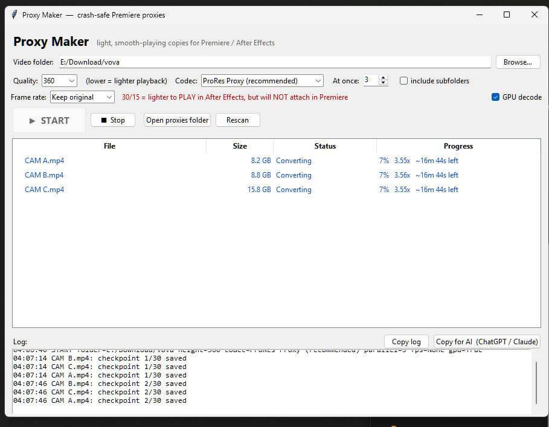

# Proxy Maker

**Turn heavy video files into lightweight, smooth‑playing proxies for video editing — crash‑safe, parallel, and one click.**

Editing 4K, high‑bitrate, or hour‑long footage directly is painful: timelines stutter, scrubbing lags, and the fans scream. The professional fix is **proxies** — small, low‑resolution stand‑in copies you edit with instead of the originals. Your editor plays the light proxies while you cut, then switches back to the full‑quality originals when you export.

Proxy Maker generates those proxies for you, from a simple window anyone can use.

---

## Why this exists

Most "just run ffmpeg" proxy scripts fall over on real footage:

- They **lose all progress if interrupted** — a crash, a closed laptop lid, a power blip — and on hour‑long files that's brutal.
- They **break audio or duration matching**, so the editor refuses to attach the proxy.
- They **choke on certain frames** with some codecs and abort the whole batch.
- They're **command‑line only**, so non‑technical teammates can't use them.

Proxy Maker is built to survive all of that.

## Features

- **One‑click GUI** — pick a folder, press START. No command line.
- **Crash‑safe checkpoints** — every file is encoded in ~2‑minute chunks saved as it goes. A crash, power loss, or early close loses at most one chunk; run it again and it continues from where it stopped.
- **Exact audio** — the original audio is copied untouched and the frame rate is preserved, so proxies attach correctly in your editor.
- **Parallel** — convert several files at once.
- **Automatic fallback** — if a codec hits a frame it can't encode, that file is re‑done automatically with another codec, so the batch always finishes.
- **Live ETAs** — per‑file and overall estimated finish time, plus when the last checkpoint was saved.
- **"Copy for AI" button** — if something fails, one click copies a complete, plain‑language description of the problem to paste into ChatGPT or Claude for help.

## Requirements

- **Python 3.8+** — <https://www.python.org/downloads/> (tick *Add python.exe to PATH* during install)
- **ffmpeg** (with `ffprobe`) on your PATH — `winget install --id Gyan.FFmpeg -e`

No pip packages required — the GUI uses Python's built‑in Tkinter.

> The one‑click launcher (`START.bat`) is for **Windows**. The app itself is plain Python and also runs on macOS/Linux with `python3 make_proxies.py`.

## Quick start

1. Download this repo (**Code → Download ZIP**, or `git clone`).
2. Double‑click **`START.bat`**.
3. Click **Browse…** and choose the folder with your videos.
4. Press **▶ START**.

Proxies land in a `proxies` subfolder next to your videos. Close and re‑run any time to continue where it left off.

## Options

| Option | What it does |
|---|---|
| **Quality** | Proxy height in pixels (360 / 540 / 720), lower = smaller and lighter playback — or **Original** to keep the full source resolution (a full‑quality transcode, not a small proxy). |
| **Codec** | **ProRes Proxy** (default, works everywhere), **ProRes 422 LT** (higher quality, larger), or **DNxHR LB** (smaller; auto‑falls back to ProRes on rare problem frames). The codec is part of the output filename, so different codecs/qualities never overwrite each other. |
| **At once** | How many files to convert in parallel. |
| **Frame rate** | *Keep original* (required for Premiere). 30/15 are lighter to play in After Effects but will **not** attach as Premiere proxies. |
| **GPU decode** | Optional; can speed up decoding on some machines. |

## How it works (for the curious)

Each file is processed like this:

1. **Chunked encoding.** The video is split into ~2‑minute segments. Each segment is re‑encoded (scaled down, intra‑frame codec) into its own file and saved atomically. **Each saved segment is a checkpoint.**
2. **Resume.** On startup, any segment already on disk is skipped — an interrupted job continues from the last checkpoint instead of restarting.
3. **Lossless stitch + exact audio.** Once all segments exist, they are concatenated *without re‑encoding*, and the **original audio is copied in** in a single pass. This keeps the proxy's frame count, duration, and audio identical to the source — the conditions an editor needs to attach a proxy.
4. **Atomic finish.** Output is written to a temporary file and only renamed to its final name once complete and verified, so a half‑written file can never look "done."

Intra‑frame codecs (ProRes / DNxHR) are used on purpose: they barely compress, which is exactly why they scrub instantly while editing.

## Size vs. speed

There is an inherent trade‑off — "small" and "plays instantly" pull in opposite directions:

| Codec (360p, 60 fps source) | ~Size per hour | Playback |
|---|---|---|
| ProRes Proxy | ~7 GB | instant scrub |
| DNxHR LB | ~4 GB | instant scrub |
| H.264 (short GOP) | ~0.3 GB | needs a GPU, still smooth |

Intra‑frame codecs win on smooth editing but produce large files. If small files matter more than guaranteed‑instant scrubbing, a short‑GOP H.264 is roughly 20× smaller and decodes fine on modern GPUs.

## Using the proxies (Premiere Pro)

Project panel → select clips → right‑click → **Proxy → Attach Proxies**, then point to the matching file in `proxies\`. Toggle proxies on/off with the proxy button in the Program monitor. On export, Premiere uses the full‑resolution originals automatically. The output `.mov` files are standard DNxHR/ProRes and work in other proxy‑capable editors as well.

## If something goes wrong

Use the **Copy log** or **Copy for AI** buttons at the bottom of the window. *Copy for AI* puts a complete, self‑contained description of the program, your settings, and the exact error on your clipboard — paste it into ChatGPT or Claude and it will know how to help. A `proxy_log.txt` is also written inside the `proxies` folder.

## License

[MIT](LICENSE) — use it, fork it, share it.

---

*Not affiliated with Adobe, Apple, Avid, or the FFmpeg project. Product names are trademarks of their respective owners.*
